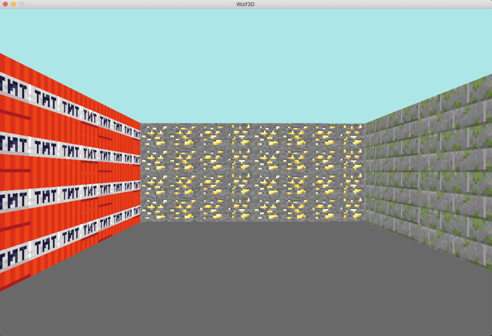

# Wolf3d
Wolfenstein 3D maze

 

# Raycasting game

**Raycasting game inspired by Wolfenstein 3D**\
Hive Helsinki graphical project. The code is written in accordance with The Norm (Hive coding style).\
Besides the raycasting algorithm itself, the project includes most of the parsing and an error handling manager for invalid input data.

Works on Mac OS only.

**Installation and launch:**
* `git clone https://github.com/lsjoberg98/Wolf3d`
* `cd Wolf3d`
* `make`
* `./Wolf3d maps/map1`

**Map:**
The game reads a text file with '1' being a wall and '0' being a walkable square.\
These files can be modified without re-compiling the program. \
See example below.

* `1 1 1 1 1 1 1 1 1 1`
* `1 0 0 0 0 0 0 0 0 1`
* `1 0 0 0 1 0 1 1 0 1`
* `1 0 1 1 1 0 1 0 0 1`
* `1 0 0 0 0 0 0 0 0 1`
* `1 1 1 1 1 1 1 1 1 1`

**Keys:**
* `W | S  - Move forward and backwards`
* `Arrows - moving and look left/right`
* `A | D  - Strafe left/right`
* `ESC    - Quit`
